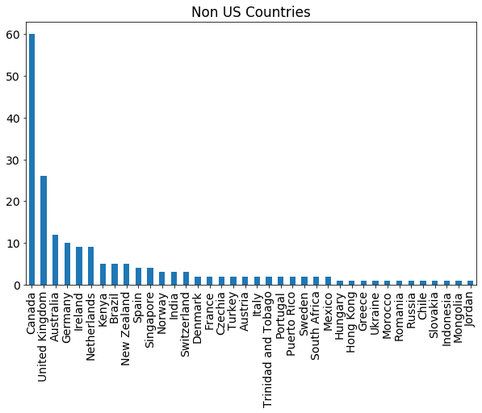
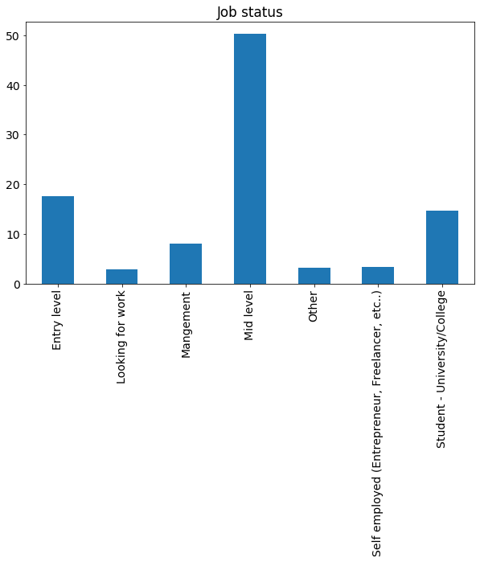
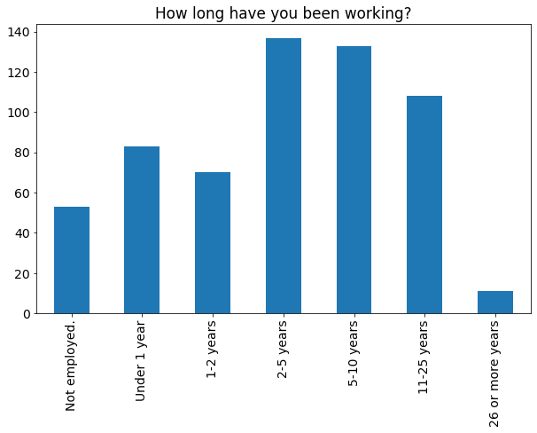

```python
# Standard import for pandas, numpy and matplot
import pandas as pd
import matplotlib
import re
import pandasql as ps
from wordcloud import WordCloud, STOPWORDS, ImageColorGenerator
import matplotlib.pyplot as plt
print(pd.__version__)
```

    1.1.5
    


```python
# Read in the 2017 csv file and display some of the basic info
survey2017=pd.read_csv("GIS_Official_Survey_2017.csv",parse_dates=['Timestamp'])
print("Data types in the file:")
print(survey2017.dtypes)
```

    Data types in the file:
    Timestamp                                                                                                          datetime64[ns, pytz.FixedOffset(-60)]
    Gender                                                                                                                                            object
    What country do you live in?                                                                                                                      object
    If United States, what state?                                                                                                                     object
    What is your race and/or ethnicity?                                                                                                               object
    What is your age?                                                                                                                                 object
    What is the highest level of education you have completed?                                                                                        object
    Where did you obtain your latest degree?                                                                                                          object
    If you obtained more than an Bachelor's (Undergraduate) Degree (like a Masters or PhD), would you recommend it?                                   object
    Job status                                                                                                                                        object
    Income level in US Dollars                                                                                                                        object
    How long have you been working?                                                                                                                   object
    If employed, what is your current job title?                                                                                                      object
    What industry do you work in?                                                                                                                     object
    What desktop GIS software do you use?                                                                                                             object
    Apart from GIS software, what other software do you use for your work? (ie Adobe Illustrator, GDAL, FME, etc)                                     object
    What are your hardware specs?                                                                                                                     object
    Does your work require programming?                                                                                                               object
    Database of choice?                                                                                                                               object
    Do you have a professional certification?                                                                                                         object
    What is your favourite projection? EPSG code preferred.                                                                                           object
    How happy are you with your choice of GIS as profession?                                                                                         float64
    How optimistic are you about the future of GIS as a profession?                                                                                  float64
    What brought you to r/gis?                                                                                                                        object
    dtype: object
    


```python
# Read in the csv file and display some of the basic info
survey2019=pd.read_csv("GIS_Official_Survey_2019.csv",parse_dates=['Timestamp'])
print("Data types in the file:")
print(survey2019.dtypes)
```

    Data types in the file:
    Timestamp                                                                                                          datetime64[ns, pytz.FixedOffset(-60)]
    Gender                                                                                                                                            object
    What country do you live in?                                                                                                                      object
    If United States, what state?                                                                                                                     object
    What is your age?                                                                                                                                 object
    What is the highest level of education you have completed?                                                                                        object
    If you obtained more than an Bachelor's (Undergraduate) Degree (like a Masters or PhD), would you recommend it?                                   object
    Job status                                                                                                                                        object
    Income level in US Dollars                                                                                                                        object
    How long have you been working?                                                                                                                   object
    If employed, what is your current job title (without the GIS)?                                                                                    object
    What industry do you work in?                                                                                                                     object
    What desktop GIS software do you use?                                                                                                             object
    What desktop GIS software do you mainly use?                                                                                                      object
    If ArcGIS, are you using Pro?                                                                                                                     object
    Do you use any design software to finish your maps?                                                                                               object
    Is your work primarily vector or raster based?                                                                                                    object
    Apart from GIS software, what other software do you use for your work?                                                                            object
    Does your work require programming?                                                                                                               object
    Database of choice?                                                                                                                               object
    Do you have a professional certification?                                                                                                         object
    How happy are you with your choice of GIS as profession?                                                                                           int64
    How optimistic are you about the future of GIS as a profession?                                                                                    int64
    dtype: object
    


```python
# Read in the 2021 csv file and display some of the basic info
survey2021=pd.read_csv("GIS_Official_Survey_2021.csv")
print("Data types in the file:")
print(survey2021.dtypes)
survey = survey2021
```

    Data types in the file:
    Gender                                                                                                              object
    What country do you live in?                                                                                        object
    If United States, what state?                                                                                       object
    What is your age?                                                                                                   object
    What is the highest level of education you have completed?                                                          object
    If you obtained more than an Bachelor's (Undergraduate) Degree (like a Masters or PhD), would you recommend it?     object
    Job status                                                                                                          object
    Income in US Dollars per year                                                                                      float64
    How long have you been working?                                                                                     object
    If employed, what is your current job title (without the GIS)?                                                      object
    Is "GIS" officially in your job title?                                                                              object
    What industry do you work in?                                                                                       object
    What desktop GIS software do you use?                                                                               object
    What desktop GIS software do you mainly use?                                                                        object
    If ArcGIS, are you using Pro?                                                                                       object
    Do you use any design software to finish your maps?                                                                 object
    Is your work primarily vector or raster based?                                                                      object
    Apart from GIS software, what other software do you use for your work?                                              object
    Does your work require programming?                                                                                 object
    Database of choice?                                                                                                 object
    Do you have a professional certification?                                                                           object
    If you obtained a professional certification, did your employer pay for it?                                         object
    If you obtained a professional certification, did you get a raise as a result?                                      object
    How many screens/monitors do you use for your work?                                                                 object
    Does (or did before COVID) you job require any field work?                                                          object
    How has the COVID-19 pandemic affected you in regard to the GIS profession?                                         object
    Are you currently work from home due to COVID-19?                                                                   object
    Will you continue to work from home for the long term?                                                              object
    How happy are you with your choice of GIS as profession?                                                             int64
    How optimistic are you about the future of GIS as a profession?                                                      int64
    Should we ban memes?                                                                                                object
    dtype: object
    


```python
%matplotlib inline

#Set matplotlib default styles:
font = {'family' : 'Sans Serif',
        'size'   : 14}

matplotlib.rc('font', **font)
matplotlib.rcParams['figure.figsize'] = (10, 6)

#Set Pandas display options:
# pd.set_option('display.height', 500) Depreciated in Pandas
pd.set_option('display.max_rows', 500)

#Set Pandas warning options:
pd.options.mode.chained_assignment = None  # default='warn'
```


```python
print(survey.count())
```

    Timestamp                                                                                                          567
    Gender                                                                                                             567
    What country do you live in?                                                                                       567
    If United States, what state?                                                                                      397
    What is your age?                                                                                                  567
    What is the highest level of education you have completed?                                                         567
    If you obtained more than an Bachelor's (Undergraduate) Degree (like a Masters or PhD), would you recommend it?    251
    Job status                                                                                                         567
    Income in US Dollars per year                                                                                      567
    How long have you been working?                                                                                    567
    If employed, what is your current job title (without the GIS)?                                                     504
    Is "GIS" officially in your job title?                                                                             522
    What industry do you work in?                                                                                      521
    What are your career goals?                                                                                        287
    What desktop GIS software do you use?                                                                              567
    What desktop GIS software do you mainly use?                                                                       567
    If ArcGIS, are you using Pro?                                                                                      504
    Do you use any design software to finish your maps?                                                                566
    Is your work primarily vector or raster based?                                                                     547
    Apart from GIS software, what other software do you use for your work?                                             497
    Does your work require programming?                                                                                567
    Database of choice?                                                                                                566
    Do you have a professional certification?                                                                          567
    If you obtained a professional certification, did your employer pay for it?                                        125
    If you obtained a professional certification, did you get a raise as a result?                                     110
    How many screens/monitors do you use for your work?                                                                562
    Does (or did before COVID) you job require any field work?                                                         521
    How has the COVID-19 pandemic affected you in regard to the GIS profession?                                        542
    Are you currently work from home due to COVID-19?                                                                  535
    Will you continue to work from home for the long term?                                                             507
    How happy are you with your choice of GIS as profession?                                                           567
    How optimistic are you about the future of GIS as a profession?                                                    567
    Should we ban memes?                                                                                               562
    What is one piece of advice you have for aspiring GIS professionals?                                               297
    Any other feedback you have for the r/gis community?                                                               115
    dtype: int64
    


```python
print("Gender counts:")

print("\nGender percentages 2017:")
oth2017 = survey2017.groupby('Gender').size().sort_values(ascending=False).index[2:]
survey_new2017  = survey2017.replace(oth2017, 'Other / Prefer not to say')
var17 = survey_new2017.groupby('Gender').size() * 100 / len(survey2017)

print("\nGender percentages 2019:")
oth2019 = survey2019.groupby('Gender').size().sort_values(ascending=False).index[2:]
survey_new2019  = survey2019.replace(oth2019, 'Other / Prefer not to say')
var19 = survey_new2019.groupby('Gender').size() * 100 / len(survey2019)

print("\nGender percentages 2021:")
oth2021 = survey2021.groupby('Gender').size().sort_values(ascending=False).index[2:]
survey_new2021  = survey2021.replace(oth2021, 'Other / Prefer not to say')
var21 = survey_new2021.groupby('Gender').size() * 100 / len(survey2021)
print(var21)

var21 = var21.to_frame()
var19 = var19.to_frame()
var17 = var17.to_frame()

var21 = var21.join(var19, how='left', lsuffix='_21', rsuffix='_19').join(var17, how='left')
var21.columns = ['2021', '2019', '2017']

my_plot = var21.plot(kind='bar', title="Gender")
my_plot.set_xlabel("")
my_plot.set_ylabel("")
my_plot.patch.set_facecolor('None') #or ax.patch.set_visible(False).

print('\n2021 Counts:')
var21 = survey_new2021.groupby('Gender').size()
print(var21)
```

    Gender counts:
    
    Gender percentages 2017:
    
    Gender percentages 2019:
    
    Gender percentages 2021:
    Gender
    Female                       19.753086
    Male                         77.954145
    Other / Prefer not to say     2.292769
    dtype: float64
    
    2021 Counts:
    Gender
    Female                       112
    Male                         442
    Other / Prefer not to say     13
    dtype: int64
    


    

    


```python
print("Unique countries:")
print(survey['What country do you live in?'].nunique())

print("\nCountry counts:")
var = survey.groupby('What country do you live in?').size().sort_values(ascending=False)
print(var)

print("\nCountry percentages:")
var2 = survey.groupby('What country do you live in?').size() * 100 / len(survey)
print(var2.sort_values(ascending=False))

my_plot = var.plot(kind='bar', title="Country")
my_plot.set_xlabel("")
my_plot.set_ylabel("")
my_plot.patch.set_facecolor('None') #or ax.patch.set_visible(False).
```

    Unique countries:
    39
    
    Country counts:
    What country do you live in?
    United States          373
    Canada                  60
    United Kingdom          26
    Australia               12
    Germany                 10
    Netherlands              9
    Ireland                  9
    Kenya                    5
    Brazil                   5
    New Zealand              5
    Spain                    4
    Singapore                4
    Switzerland              3
    India                    3
    Norway                   3
    Austria                  2
    Czechia                  2
    Denmark                  2
    France                   2
    Italy                    2
    Trinidad and Tobago      2
    Mexico                   2
    Portugal                 2
    Sweden                   2
    South Africa             2
    Puerto Rico              2
    Turkey                   2
    Indonesia                1
    Hungary                  1
    Hong Kong                1
    Greece                   1
    Jordan                   1
    Romania                  1
    Russia                   1
    Slovakia                 1
    Chile                    1
    Ukraine                  1
    Morocco                  1
    Mongolia                 1
    dtype: int64
    
    Country percentages:
    What country do you live in?
    United States          65.784832
    Canada                 10.582011
    United Kingdom          4.585538
    Australia               2.116402
    Germany                 1.763668
    Netherlands             1.587302
    Ireland                 1.587302
    Kenya                   0.881834
    Brazil                  0.881834
    New Zealand             0.881834
    Spain                   0.705467
    Singapore               0.705467
    Switzerland             0.529101
    India                   0.529101
    Norway                  0.529101
    Austria                 0.352734
    Czechia                 0.352734
    Denmark                 0.352734
    France                  0.352734
    Italy                   0.352734
    Trinidad and Tobago     0.352734
    Mexico                  0.352734
    Portugal                0.352734
    Sweden                  0.352734
    South Africa            0.352734
    Puerto Rico             0.352734
    Turkey                  0.352734
    Indonesia               0.176367
    Hungary                 0.176367
    Hong Kong               0.176367
    Greece                  0.176367
    Jordan                  0.176367
    Romania                 0.176367
    Russia                  0.176367
    Slovakia                0.176367
    Chile                   0.176367
    Ukraine                 0.176367
    Morocco                 0.176367
    Mongolia                0.176367
    dtype: float64
    


    

    


```python
print("\nUS vs NonUS")

# Grab all countries apart from the US. So second onwards.
not_US = survey.groupby('What country do you live in?').size().sort_values(ascending=False).index[1:]
survey_new  = survey.replace(not_US, 'Other')
survey_new.groupby('What country do you live in?').size()

var = survey_new.groupby('What country do you live in?').size().sort_values(ascending=False)
print(var)

print("\nCountry percentages:")
var2 = survey_new.groupby('What country do you live in?').size() * 100 / len(survey)
print(var2.sort_values(ascending=False))

my_plot = var.plot(kind='bar', title="US vs Other")
my_plot.set_xlabel("")
my_plot.set_ylabel("")
my_plot.patch.set_facecolor('None') #or ax.patch.set_visible(False).
```

    
    US vs NonUS
    What country do you live in?
    United States    373
    Other            194
    dtype: int64
    
    Country percentages:
    What country do you live in?
    United States    65.784832
    Other            34.215168
    dtype: float64
    


    

    


```python
#Non us country plot
mask = survey['What country do you live in?'].isin(["United States"])
non_us_survey = survey[~mask]
var3 = non_us_survey.groupby('What country do you live in?').size().sort_values(ascending=False)

my_plot2 = var3.plot(kind='bar', title="Non US Countries")
my_plot2.set_xlabel("")
my_plot2.set_ylabel("")
my_plot2.patch.set_facecolor('None') #or ax.patch.set_visible(False).
```


    

    


```python
#US State
mask = survey['What country do you live in?'].isin(["United States"])
us_survey = survey[mask]

print("State counts:")
var = us_survey.groupby('If United States, what state?').size().sort_values(ascending=False)
print(var)

print("\nState percentages:")
var2 = us_survey.groupby('If United States, what state?').size() * 100 / len(us_survey)
print(var2.sort_values(ascending=False))

my_plot = var.plot(kind='bar', title="State")
my_plot.set_xlabel("")
my_plot.set_ylabel("")
my_plot.patch.set_facecolor('None') #or ax.patch.set_visible(False).
```

    State counts:
    If United States, what state?
    California        50
    Texas             29
    Virginia          20
    Colorado          20
    Pennsylvania      16
    Washington        15
    Oregon            14
    North Carolina    13
    Maryland          12
    Florida           12
    Arizona           11
    Ohio              10
    Michigan           9
    New York           9
    Missouri           9
    Tennessee          9
    Illinois           8
    Wisconsin          7
    Minnesota          7
    Utah               7
    New Jersey         5
    Arkansas           5
    Massachusetts      5
    South Carolina     5
    South Dakota       5
    Georgia            5
    Kentucky           4
    Iowa               4
    New Mexico         4
    Oklahoma           4
    Indiana            3
    Washington D.C     3
    Idaho              2
    Alaska             2
    Montana            2
    Alabama            2
    Kansas             2
    Louisiana          2
    Maine              2
    Nebraska           2
    Nevada             2
    Mississippi        1
    Connecticut        1
    New Hampshire      1
    North Dakota       1
    Rhode Island       1
    Wyoming            1
    dtype: int64
    
    State percentages:
    If United States, what state?
    California        13.404826
    Texas              7.774799
    Virginia           5.361930
    Colorado           5.361930
    Pennsylvania       4.289544
    Washington         4.021448
    Oregon             3.753351
    North Carolina     3.485255
    Maryland           3.217158
    Florida            3.217158
    Arizona            2.949062
    Ohio               2.680965
    Michigan           2.412869
    New York           2.412869
    Missouri           2.412869
    Tennessee          2.412869
    Illinois           2.144772
    Wisconsin          1.876676
    Minnesota          1.876676
    Utah               1.876676
    New Jersey         1.340483
    Arkansas           1.340483
    Massachusetts      1.340483
    South Carolina     1.340483
    South Dakota       1.340483
    Georgia            1.340483
    Kentucky           1.072386
    Iowa               1.072386
    New Mexico         1.072386
    Oklahoma           1.072386
    Indiana            0.804290
    Washington D.C     0.804290
    Idaho              0.536193
    Alaska             0.536193
    Montana            0.536193
    Alabama            0.536193
    Kansas             0.536193
    Louisiana          0.536193
    Maine              0.536193
    Nebraska           0.536193
    Nevada             0.536193
    Mississippi        0.268097
    Connecticut        0.268097
    New Hampshire      0.268097
    North Dakota       0.268097
    Rhode Island       0.268097
    Wyoming            0.268097
    dtype: float64
    


    

    


```python
print("Age counts:")
var = survey.groupby('What is your age?').size()
print(var)

print("\nAge percentages:")
var2 = survey.groupby('What is your age?').size() * 100 / len(survey)
print(var2)

my_plot = var.plot(kind='bar', title="Age")
my_plot.set_xlabel("")
my_plot.set_ylabel("")
my_plot.patch.set_facecolor('None') #or ax.patch.set_visible(False).
```

    Age counts:
    What is your age?
    18 to 24    120
    25 to 34    308
    35 to 44    106
    45 to 54     25
    55 to 64      7
    65 to 74      1
    dtype: int64
    
    Age percentages:
    What is your age?
    18 to 24    21.164021
    25 to 34    54.320988
    35 to 44    18.694885
    45 to 54     4.409171
    55 to 64     1.234568
    65 to 74     0.176367
    dtype: float64
    


    

    


```python
print("Education counts:")
var = survey.groupby('What is the highest level of education you have completed?').size().sort_values(ascending=False)
print(var)

# Create Other Category
other_edu = survey.groupby('What is the highest level of education you have completed?').size().sort_values(ascending=False).index[5:]
survey_new  = survey.replace(other_edu, 'Other')
survey_new.groupby('What is the highest level of education you have completed?').size()

print("Education counts:")
var = survey_new.groupby('What is the highest level of education you have completed?').size().sort_values(ascending=False)
print(var)

print("\nEducation percentages:")
var2 = survey_new.groupby('What is the highest level of education you have completed?').size() * 100 / len(survey)
print(var2.sort_values(ascending=False))

my_plot = var.plot(kind='bar', title="Education")
my_plot.set_xlabel("")
my_plot.set_ylabel("")
my_plot.patch.set_facecolor('None') #or ax.patch.set_visible(False).
```

    Education counts:
    What is the highest level of education you have completed?
    Bachelor's (Undergraduate) Degree                                                                        299
    Master's Degree                                                                                          186
    High School or equivalent                                                                                 41
    2-Year Degree (Technical, Certificate, Associate's, etc)                                                  16
    Doctorate degree                                                                                          12
    Some college                                                                                               2
    Federal VET Diploma in Geomatics                                                                           1
    3-Year Degree (Technical)                                                                                  1
    BSc Honours Degree - South Africa                                                                          1
    still i school for GIS, but have masters in Polisci                                                        1
    Graduate Certificate (like a Master's without a thesis)                                                    1
    I have a BA in Environmental Science and two Graduate Certificates. 1 in GIS and 1 in Data Analytics.      1
    In a PhD program now                                                                                       1
    Less than High School                                                                                      1
    Post Bachelor's Certificate                                                                                1
    Post graduate certificate                                                                                  1
    1 year post-grad GIS diploma after bachelor                                                                1
    dtype: int64
    Education counts:
    What is the highest level of education you have completed?
    Bachelor's (Undergraduate) Degree                           299
    Master's Degree                                             186
    High School or equivalent                                    41
    2-Year Degree (Technical, Certificate, Associate's, etc)     16
    Other                                                        13
    Doctorate degree                                             12
    dtype: int64
    
    Education percentages:
    What is the highest level of education you have completed?
    Bachelor's (Undergraduate) Degree                           52.733686
    Master's Degree                                             32.804233
    High School or equivalent                                    7.231041
    2-Year Degree (Technical, Certificate, Associate's, etc)     2.821869
    Other                                                        2.292769
    Doctorate degree                                             2.116402
    dtype: float64
    


    

    


```python
# Should I do a Masters/PhD
mask = survey_new2021['What is the highest level of education you have completed?'].isin(["Master's Degree","2-Year Degree (Technical, Certificate, Associate's, etc)","Doctorate degree"])
higher_edu_survey = survey_new2021[mask]

print("Counts:")
var = higher_edu_survey.groupby("If you obtained more than an Bachelor's (Undergraduate) Degree (like a Masters or PhD), would you recommend it?").size().sort_values(ascending=False).nlargest(3)
print(var)

print("\nPercentages:")
var2 = higher_edu_survey.groupby("If you obtained more than an Bachelor's (Undergraduate) Degree (like a Masters or PhD), would you recommend it?").size() * 100 / len(higher_edu_survey)
print(var2.sort_values(ascending=False).nlargest(3))

# Rename our colmun, who designed this survey!?!?!
higher_edu_survey2 = higher_edu_survey[["If you obtained more than an Bachelor's (Undergraduate) Degree (like a Masters or PhD), would you recommend it?", "What is the highest level of education you have completed?"]]
higher_edu_survey2.columns = ['a', 'b']

print("\nMasters vs PhD:")
var3 = higher_edu_survey2.groupby(['a', 'b']).size().sort_values(ascending=False).nlargest(5)
print(var3)

my_plot = var3.plot(kind='bar', title="Should I do a Masters/PhD?")
my_plot.set_xlabel("")
my_plot.set_ylabel("")
my_plot.patch.set_facecolor('None') #or ax.patch.set_visible(False).
```

    Counts:
    If you obtained more than an Bachelor's (Undergraduate) Degree (like a Masters or PhD), would you recommend it?
    Yes      112
    Maybe     63
    No        11
    dtype: int64
    
    Percentages:
    If you obtained more than an Bachelor's (Undergraduate) Degree (like a Masters or PhD), would you recommend it?
    Yes      52.336449
    Maybe    29.439252
    No        5.140187
    dtype: float64
    
    Masters vs PhD:
    a      b               
    Yes    Master's Degree     107
    Maybe  Master's Degree      57
    No     Master's Degree      10
    Maybe  Doctorate degree      6
    Yes    Doctorate degree      5
    dtype: int64
    


    

    


```python
print("Job status counts:")
var = survey.groupby('Job status').size().sort_values(ascending=False)
print(var)

print("\nJob status percentages:")
var2 = survey.groupby('Job status').size() * 100 / len(survey)
print(var2.sort_values(ascending=False))

# Create Other Category
job_stat = survey.groupby('Job status').size().sort_values(ascending=False).index[6:]
survey_new  = survey.replace(job_stat, 'Other')
survey_new.groupby('Job status').size()
var2 = survey_new.groupby('Job status').size() * 100 / len(survey)


my_plot = var2.plot(kind='bar', title="Job status")
my_plot.set_xlabel("")
my_plot.set_ylabel("")
my_plot.patch.set_facecolor('None') #or ax.patch.set_visible(False).
```

    Job status counts:
    Job status
    Mid level                                                                              285
    Entry level                                                                            100
    Student - University/College                                                            83
    Mangement                                                                               46
    Self employed (Entrepreneur, Freelancer, etc..)                                         19
    Looking for work                                                                        16
    Associate Professor, tenured, in Geography department                                    1
    Employed doing work with aerial imagery that isn't quite GIS work                        1
    Employed in a different field                                                            1
    Faculty                                                                                  1
    Full time and freelance.                                                                 1
    GIS Work study student                                                                   1
    Looking for work in current country, working part time remotely for another country      1
    student/intern                                                                           1
    Student/Intern                                                                           1
    Research                                                                                 1
    Senior                                                                                   1
    Senior Consultant                                                                        1
    Senior Level                                                                             1
    Senior level                                                                             1
    Senior level non-management                                                              1
    Student Job in my field                                                                  1
    Student working on AS, Freelancer, and I work for a company full time.                   1
    Above mid level, not management                                                          1
    dtype: int64
    
    Job status percentages:
    Job status
    Mid level                                                                              50.264550
    Entry level                                                                            17.636684
    Student - University/College                                                           14.638448
    Mangement                                                                               8.112875
    Self employed (Entrepreneur, Freelancer, etc..)                                         3.350970
    Looking for work                                                                        2.821869
    Associate Professor, tenured, in Geography department                                   0.176367
    Employed doing work with aerial imagery that isn't quite GIS work                       0.176367
    Employed in a different field                                                           0.176367
    Faculty                                                                                 0.176367
    Full time and freelance.                                                                0.176367
    GIS Work study student                                                                  0.176367
    Looking for work in current country, working part time remotely for another country     0.176367
    student/intern                                                                          0.176367
    Student/Intern                                                                          0.176367
    Research                                                                                0.176367
    Senior                                                                                  0.176367
    Senior Consultant                                                                       0.176367
    Senior Level                                                                            0.176367
    Senior level                                                                            0.176367
    Senior level non-management                                                             0.176367
    Student Job in my field                                                                 0.176367
    Student working on AS, Freelancer, and I work for a company full time.                  0.176367
    Above mid level, not management                                                         0.176367
    dtype: float64
    


    

    


```python
print("How long have you been working?")

work_len_survey = survey
work_len_survey['How long have you been working?'] = pd.Categorical(work_len_survey['How long have you been working?'], ["Not employed.","Under 1 year","1-2 years","2-5 years","5-10 years","11-25 years","26 or more years"])

print("\nCount:")
var = work_len_survey.groupby('How long have you been working?').size()
print(var)

print("\nPercentage:")
var2 = work_len_survey.groupby('How long have you been working?').size() * 100 / len(survey)
print(var2)

my_plot = var.plot(kind='bar', title="How long have you been working?")
my_plot.set_xlabel("")
my_plot.set_ylabel("")
my_plot.patch.set_facecolor('None') #or ax.patch.set_visible(False).
```

    How long have you been working?
    
    Count:
    How long have you been working?
    Not employed.        53
    Under 1 year         83
    1-2 years            70
    2-5 years           137
    5-10 years          133
    11-25 years         108
    26 or more years     11
    dtype: int64
    
    Percentage:
    How long have you been working?
    Not employed.        8.907563
    Under 1 year        13.949580
    1-2 years           11.764706
    2-5 years           23.025210
    5-10 years          22.352941
    11-25 years         18.151261
    26 or more years     1.848739
    dtype: float64
    


    

    


```python
# New

print("Income level 2021")

income_survey = None
income_survey = survey2021

var = income_survey['Income in US Dollars per year']
var = var[var > 5000].dropna()

# $ Mess up matplotlib charts

my_plot = var.plot(kind='hist', title="Income level in US Dollars", bins=100 ,range=(0,200000))
my_plot.set_xlabel("")
my_plot.set_ylabel("")
my_plot.axvline(var.mean(), color='k', linestyle='dashed', linewidth=1)
my_plot.text(var.mean()*1.05, 33, 'Average: {:.2f}'.format(var.mean()))
my_plot.patch.set_facecolor('None') #or ax.patch.set_visible(False).
```

    Income level 2021
    


    

    


```python
print("Work length vs salary:")

survey=pd.read_csv("GIS_Official_Survey_2021.csv",parse_dates=['Timestamp'])
work_len_salary = survey[['Income in US Dollars per year','How long have you been working?']]

work_len_salary = work_len_salary[work_len_salary['Income in US Dollars per year'] > 5000].dropna()

order_list = ["Not employed.","Under 1 year","1-2 years","2-5 years","5-10 years","11-25 years","26 or more years"]

work_len_salary['How long have you been working?'] = pd.Categorical(work_len_salary['How long have you been working?'], order_list , ordered=True)

work_len_salary = work_len_salary.sort_values('How long have you been working?')

avg_list = []
for x in order_list:
    avg_list.append([x, work_len_salary.loc[work_len_salary['How long have you been working?'] == x].median()[0]])
    print(x, '\t', 'Median salary: {:.2f} Responses: {:.0f}'.format(work_len_salary.loc[work_len_salary['How long have you been working?'] == x].median()[0], work_len_salary.loc[work_len_salary['How long have you been working?'] == x].count()[0]))
avg_list = pd.DataFrame(avg_list,columns=['cat','Median'])

my_plot = work_len_salary.plot(x = 'How long have you been working?', y = 'Income in US Dollars per year', kind='scatter')
avg_list.plot(ax=my_plot)
my_plot.set_xlabel("")
my_plot.set_ylabel("")
my_plot.set_ylim(0,200000)
my_plot.patch.set_facecolor('None') #or ax.patch.set_visible(False).

my_plot.set_xticklabels(order_list, rotation=90)
```

    Work length vs salary:
    Not employed. 	 Median salary: 13000.00 Responses: 15
    Under 1 year 	 Median salary: 38000.00 Responses: 53
    1-2 years 	 Median salary: 40000.00 Responses: 59
    2-5 years 	 Median salary: 55000.00 Responses: 147
    5-10 years 	 Median salary: 66500.00 Responses: 122
    11-25 years 	 Median salary: 75000.00 Responses: 100
    26 or more years 	 Median salary: 63250.00 Responses: 12
    


    [Text(0, 0, 'Not employed.'),
     Text(0, 0, 'Under 1 year'),
     Text(0, 0, '1-2 years'),
     Text(0, 0, '2-5 years'),
     Text(0, 0, '5-10 years'),
     Text(0, 0, '11-25 years'),
     Text(0, 0, '26 or more years')]


    

    


```python
print("Work length vs salary vs gender:")


survey=pd.read_csv("GIS_Official_Survey_2021.csv",parse_dates=['Timestamp'])
work_len_salary = survey[['Income in US Dollars per year','How long have you been working?', 'Gender']]

work_len_salary = work_len_salary[work_len_salary['Income in US Dollars per year'] > 5000].dropna()

oth2021 = work_len_salary.groupby('Gender').size().sort_values(ascending=False).index[2:]
work_len_salary = work_len_salary.replace(oth2021, None).dropna()

order_list = ["Not employed.","Under 1 year","1-2 years","2-5 years","5-10 years","11-25 years","26 or more years"]

work_len_salary['How long have you been working?'] = pd.Categorical(work_len_salary['How long have you been working?'], order_list , ordered=True)

work_len_salary = work_len_salary.sort_values('How long have you been working?')

work_len_salary_female = work_len_salary.loc[work_len_salary['Gender'] == 'Female']
work_len_salary_male =  work_len_salary.loc[work_len_salary['Gender'] == 'Male']

avg_list = []
for x in order_list:
    avg_list.append([
        x,
        work_len_salary.loc[work_len_salary['How long have you been working?'] == x].median()[0],
        work_len_salary_male.loc[work_len_salary_male['How long have you been working?'] == x].median()[0],
        work_len_salary_female.loc[work_len_salary_female['How long have you been working?'] == x].median()[0]
    ])
    print(x)
    print('Median salary:        {:.2f} Responses: {:.0f}'.format(work_len_salary.loc[work_len_salary['How long have you been working?'] == x].median()[0], work_len_salary.loc[work_len_salary['How long have you been working?'] == x].count()[0]))
    print('Median male salary:   {:.2f} Responses: {:.0f}'.format(work_len_salary_male.loc[work_len_salary_male['How long have you been working?'] == x].median()[0], work_len_salary_male.loc[work_len_salary_male['How long have you been working?'] == x].count()[0]))
    print('Median female salary: {:.2f} Responses: {:.0f}'.format(work_len_salary_female.loc[work_len_salary_female['How long have you been working?'] == x].median()[0], work_len_salary_female[work_len_salary_female['How long have you been working?'] == x].count()[0]))
avg_list = pd.DataFrame(avg_list,columns=['cat','Median','Male Median','Female Median'])
    
my_plot = work_len_salary_male.plot(x = 'How long have you been working?', y = 'Income in US Dollars per year', kind='scatter', color='y' , label='Male Median')
work_len_salary_female.plot(x = 'How long have you been working?', y = 'Income in US Dollars per year', kind='scatter', color='black', ax=my_plot, label='Female Median')
#avg_list['Median'].plot(ax=my_plot)
avg_list['Male Median'].plot(ax=my_plot, color='y')
avg_list['Female Median'].plot(ax=my_plot, color='black')


my_plot.set_xlabel("")
my_plot.set_ylabel("")
my_plot.set_ylim(0,200000)
my_plot.set_xticklabels(order_list, rotation=90)
my_plot.patch.set_facecolor('None') #or ax.patch.set_visible(False).

```

    Work length vs salary vs gender:
    Not employed.
    Median salary:        13000.00 Responses: 15
    Median male salary:   15000.00 Responses: 12
    Median female salary: 10000.00 Responses: 3
    Under 1 year
    Median salary:        38000.00 Responses: 53
    Median male salary:   39000.00 Responses: 42
    Median female salary: 33280.00 Responses: 11
    1-2 years
    Median salary:        40000.00 Responses: 59
    Median male salary:   40000.00 Responses: 44
    Median female salary: 42000.00 Responses: 15
    2-5 years
    Median salary:        55000.00 Responses: 147
    Median male salary:   55500.00 Responses: 118
    Median female salary: 55000.00 Responses: 29
    5-10 years
    Median salary:        66500.00 Responses: 122
    Median male salary:   70000.00 Responses: 95
    Median female salary: 59000.00 Responses: 27
    11-25 years
    Median salary:        75000.00 Responses: 100
    Median male salary:   75000.00 Responses: 86
    Median female salary: 71500.00 Responses: 14
    26 or more years
    Median salary:        63250.00 Responses: 12
    Median male salary:   70750.00 Responses: 10
    Median female salary: 30000.00 Responses: 2
    


    

    


```python
print("Work length vs salary vs US Non-US:")

survey=pd.read_csv("GIS_Official_Survey_2021.csv",parse_dates=['Timestamp'])
work_len_salary = survey[['Income in US Dollars per year','How long have you been working?', 'What country do you live in?']]

work_len_salary = work_len_salary[work_len_salary['Income in US Dollars per year'] > 5000].dropna()

not_US = work_len_salary.groupby('What country do you live in?').size().sort_values(ascending=False).index[1:]
work_len_salary  = work_len_salary.replace(not_US, 'Other')

order_list = ["Not employed.","Under 1 year","1-2 years","2-5 years","5-10 years","11-25 years","26 or more years"]

work_len_salary['How long have you been working?'] = pd.Categorical(work_len_salary['How long have you been working?'], order_list , ordered=True)

work_len_salary = work_len_salary.sort_values('How long have you been working?')

work_len_salary_US = work_len_salary.loc[work_len_salary['What country do you live in?'] == 'United States']
work_len_salary_Non_US =  work_len_salary.loc[work_len_salary['What country do you live in?'] == 'Other']

avg_list = []
for x in order_list:
    avg_list.append([
        x,
        work_len_salary.loc[work_len_salary['How long have you been working?'] == x].median()[0],
        work_len_salary_US.loc[work_len_salary_US['How long have you been working?'] == x].median()[0],
        work_len_salary_Non_US.loc[work_len_salary_Non_US['How long have you been working?'] == x].median()[0]
    ])
    print(x)
    print('Average salary:        {:.2f} Responses: {:.0f}'.format(work_len_salary.loc[work_len_salary['How long have you been working?'] == x].mean()[0], work_len_salary.loc[work_len_salary['How long have you been working?'] == x].count()[0]))
    print('Average US salary:     {:.2f} Responses: {:.0f}'.format(work_len_salary_US.loc[work_len_salary_US['How long have you been working?'] == x].mean()[0], work_len_salary_US.loc[work_len_salary_US['How long have you been working?'] == x].count()[0]))
    print('Average non-US salary: {:.2f} Responses: {:.0f}'.format(work_len_salary_Non_US.loc[work_len_salary_Non_US['How long have you been working?'] == x].mean()[0], work_len_salary_Non_US[work_len_salary_Non_US['How long have you been working?'] == x].count()[0]))
avg_list = pd.DataFrame(avg_list,columns=['cat','Median','US Median','Non-US Median'])

my_plot = work_len_salary_US.plot(x = 'How long have you been working?', y = 'Income in US Dollars per year', kind='scatter', color='y', label='US Median')
ax2 = work_len_salary_Non_US.plot(x = 'How long have you been working?', y = 'Income in US Dollars per year', kind='scatter', color='black', label='Non-US Median', ax=my_plot)
avg_list['US Median'].plot(ax=my_plot, color='y')
avg_list['Non-US Median'].plot(ax=my_plot, color='black')

my_plot.set_xlabel("")
my_plot.set_ylabel("")
my_plot.set_ylim(0,200000)
my_plot.set_xticklabels(order_list, rotation=90)
my_plot.patch.set_facecolor('None') #or ax.patch.set_visible(False).

```

    Work length vs salary vs US Non-US:
    Not employed.
    Average salary:        16800.00 Responses: 15
    Average US salary:     19750.00 Responses: 8
    Average non-US salary: 13428.57 Responses: 7
    Under 1 year
    Average salary:        36422.32 Responses: 53
    Average US salary:     38593.00 Responses: 35
    Average non-US salary: 32201.56 Responses: 18
    1-2 years
    Average salary:        39149.93 Responses: 59
    Average US salary:     45377.53 Responses: 38
    Average non-US salary: 27880.95 Responses: 21
    2-5 years
    Average salary:        56570.16 Responses: 147
    Average US salary:     59540.35 Responses: 111
    Average non-US salary: 47412.07 Responses: 36
    5-10 years
    Average salary:        69688.91 Responses: 122
    Average US salary:     75446.47 Responses: 82
    Average non-US salary: 57885.90 Responses: 40
    11-25 years
    Average salary:        85828.01 Responses: 100
    Average US salary:     88925.73 Responses: 70
    Average non-US salary: 78600.00 Responses: 30
    26 or more years
    Average salary:        76625.00 Responses: 12
    Average US salary:     63071.43 Responses: 7
    Average non-US salary: 95600.00 Responses: 5
    


    

    


```python
print("Work length vs salary vs Programming:")

survey=pd.read_csv("GIS_Official_Survey_2021.csv",parse_dates=['Timestamp'])
work_len_salary = survey[['Income in US Dollars per year','How long have you been working?', 'Does your work require programming?']]

work_len_salary = work_len_salary[work_len_salary['Income in US Dollars per year'] > 5000].dropna()

work_len_salary['Does your work require programming?'] = work_len_salary['Does your work require programming?'].map({'No':'No'}).fillna('Yes')

order_list = ["Not employed.","Under 1 year","1-2 years","2-5 years","5-10 years","11-25 years","26 or more years"]

work_len_salary['How long have you been working?'] = pd.Categorical(work_len_salary['How long have you been working?'], order_list , ordered=True)

work_len_salary = work_len_salary.sort_values('How long have you been working?')

work_len_salary_Prog = work_len_salary.loc[work_len_salary['Does your work require programming?'] == 'Yes']
work_len_salary_Non_Prog =  work_len_salary.loc[work_len_salary['Does your work require programming?'] == 'No']

avg_list = []
for x in order_list:
    avg_list.append([
        x,
        work_len_salary.loc[work_len_salary['How long have you been working?'] == x].median()[0],
        work_len_salary_Prog.loc[work_len_salary_Prog['How long have you been working?'] == x].median()[0],
        work_len_salary_Non_Prog.loc[work_len_salary_Non_Prog['How long have you been working?'] == x].median()[0]
    ])
    print(x)
    print('Average salary:                 {:.2f} Responses: {:.0f}'.format(work_len_salary.loc[work_len_salary['How long have you been working?'] == x].mean()[0], work_len_salary.loc[work_len_salary['How long have you been working?'] == x].count()[0]))
    print('Average salary programming:     {:.2f} Responses: {:.0f}'.format(work_len_salary_Prog.loc[work_len_salary_Prog['How long have you been working?'] == x].mean()[0], work_len_salary_Prog.loc[work_len_salary_Prog['How long have you been working?'] == x].count()[0]))
    print('Average salary non-programming: {:.2f} Responses: {:.0f}'.format(work_len_salary_Non_Prog.loc[work_len_salary_Non_Prog['How long have you been working?'] == x].mean()[0], work_len_salary_Non_Prog[work_len_salary_Non_Prog['How long have you been working?'] == x].count()[0]))
avg_list = pd.DataFrame(avg_list,columns=['cat','Median','Prog Median','Non-Prog Median'])

my_plot = work_len_salary_Prog.plot(x = 'How long have you been working?', y = 'Income in US Dollars per year', kind='scatter', color='y', label='Prog')
ax2 = work_len_salary_Non_Prog.plot(x = 'How long have you been working?', y = 'Income in US Dollars per year', kind='scatter', color='black', label='Non-Prog', ax=my_plot)
avg_list['Prog Median'].plot(ax=my_plot, color='y')
avg_list['Non-Prog Median'].plot(ax=my_plot, color='black')

my_plot.set_xlabel("")
my_plot.set_ylabel("")
my_plot.set_ylim(0,200000)
my_plot.set_xticklabels(order_list, rotation=90)
my_plot.patch.set_facecolor('None') #or ax.patch.set_visible(False).

```

    Work length vs salary vs Programming:
    Not employed.
    Average salary:                 16800.00 Responses: 15
    Average salary programming:     20000.00 Responses: 8
    Average salary non-programming: 13142.86 Responses: 7
    Under 1 year
    Average salary:                 36422.32 Responses: 53
    Average salary programming:     36828.12 Responses: 33
    Average salary non-programming: 35752.75 Responses: 20
    1-2 years
    Average salary:                 39149.93 Responses: 59
    Average salary programming:     40382.76 Responses: 29
    Average salary non-programming: 37958.20 Responses: 30
    2-5 years
    Average salary:                 56570.16 Responses: 147
    Average salary programming:     59495.93 Responses: 92
    Average salary non-programming: 51676.15 Responses: 55
    5-10 years
    Average salary:                 69688.91 Responses: 122
    Average salary programming:     77435.59 Responses: 73
    Average salary non-programming: 58147.94 Responses: 49
    11-25 years
    Average salary:                 85828.01 Responses: 100
    Average salary programming:     94325.40 Responses: 63
    Average salary non-programming: 71359.49 Responses: 37
    26 or more years
    Average salary:                 76625.00 Responses: 12
    Average salary programming:     74055.56 Responses: 9
    Average salary non-programming: 84333.33 Responses: 3
    


    

    


```python
print("Job Title")

# Create Other Category
other_work = survey.groupby('If employed, what is your current job title (without the GIS)?').size().sort_values(ascending=False).index[19:]
work_new  = survey.replace(other_work, 'Other')

print("\nCount:")
var = work_new.groupby('If employed, what is your current job title (without the GIS)?').size() #.sort_values(ascending=False)
print(var)

q1 = '''
SELECT "If employed, what is your current job title (without the GIS)?" as title, round(avg("Income in US Dollars per year"),0) as income, count(*) as count
FROM survey
where "Income in US Dollars per year" between 5000 and 200000
group by "If employed, what is your current job title (without the GIS)?"
having count(*) > 4
order by avg("Income in US Dollars per year") DESC
limit 15
'''

print(ps.sqldf(q1, locals()))
```

    Job Title
    
    Count:
    If employed, what is your current job title (without the GIS)?
    Analyst               120
    Cartographer            4
    Consultant             31
    Coordinator            16
    Developer              34
    Geographer              2
    Intern                 16
    Manager                31
    Other                  63
    Planner                 5
    Project Manager        11
    Research Analyst       13
    Research Assistant     16
    Researcher             11
    Scientist               2
    Senior Analyst          3
    Solutions Engineer      3
    Specialist             70
    Support Specialist      7
    Technician             46
    dtype: int64
                     title   income  count
    0           Consultant  79081.0     29
    1      Project Manager  74909.0     11
    2              Manager  73938.0     30
    3            Developer  73370.0     33
    4           Specialist  61738.0     68
    5     Research Analyst  61458.0     12
    6          Coordinator  60827.0     15
    7              Analyst  59930.0    119
    8   Support Specialist  58800.0      7
    9              Planner  49914.0      5
    10          Researcher  48700.0     10
    11          Technician  46109.0     45
    12  Research Assistant  31631.0     13
    13                None  26320.0     25
    14              Intern  21949.0     12
    


```python
print('Is "GIS" officially in your job title?')

# Create Other Category
other_work = survey.groupby('Is "GIS" officially in your job title?').size().sort_values(ascending=False).index[2:]
work_new  = survey.replace(other_work, 'Other')

print("\nCount:")
var = work_new.groupby('Is "GIS" officially in your job title?').size()
print(var)

print("\nPercentage:")
var2 = work_new.groupby('Is "GIS" officially in your job title?').size() * 100 / survey.count()['Is "GIS" officially in your job title?']
print(var2)
```

    Is "GIS" officially in your job title?
    
    Count:
    Is "GIS" officially in your job title?
    No       213
    Other     30
    Yes      279
    dtype: int64
    
    Percentage:
    Is "GIS" officially in your job title?
    No       40.804598
    Other     5.747126
    Yes      53.448276
    dtype: float64
    


```python
print("Industry")

print("\nWorks in/with Government:")
print(survey['What industry do you work in?'].str.contains(r'Gov|gov').sum(), "out of", len(survey))

print("\nCount:")
other_industry = survey.groupby('What industry do you work in?').size().sort_values(ascending=False).index[27:]
ind_new  = survey.replace(other_industry, 'Other')

var = ind_new.groupby('What industry do you work in?').size().sort_values(ascending=False)
print(var)

q1 = '''
SELECT "What industry do you work in?" as industry, round(avg("Income in US Dollars per year"),0) as income, count(*)
FROM survey
where "Income in US Dollars per year" between 5000 and 200000
group by "What industry do you work in?"
having count(*) > 4
order by avg("Income in US Dollars per year") DESC
limit 15
'''

print(ps.sqldf(q1, locals()))
```

    Industry
    
    Works in/with Government:
    131 out of 567
    
    Count:
    What industry do you work in?
    Local Government        93
    GIS                     43
    Consulting              42
    Academia                36
    Environmental           36
    Other                   35
    Central Government      31
    Utilities               29
    Transportation          17
    Engineering             16
    IT                      15
    Civil Engineering       14
    Defense                 14
    Telecommunications      13
    Non-Profit              12
    Energy                  11
    Oil and Gas              9
    Natural Resources        8
    Public Health            7
    Archaeology              7
    Forestry                 7
    Real Estate              6
    Insurance                6
    Education                4
    Currently a student      4
    Mining                   2
    Federal Government       2
    Agriculture              2
    dtype: int64
                  industry   income  count(*)
    0          Oil and Gas  88056.0         9
    1              Defense  76610.0        14
    2          Real Estate  76000.0         5
    3    Civil Engineering  70360.0        12
    4                   IT  70267.0        15
    5               Energy  68791.0        11
    6                  GIS  66295.0        42
    7           Consulting  65604.0        41
    8            Insurance  64749.0         6
    9    Natural Resources  63857.0         7
    10  Telecommunications  61412.0        13
    11            Forestry  59536.0         7
    12    Local Government  59380.0        91
    13  Central Government  57710.0        30
    14           Utilities  55669.0        28
    


```python
print("What are your career goals?")

career_2021=pd.read_csv("2021_career_goals.csv")

career_2021=career_2021['What are your career goals?']

words = ''
for s in career_2021:
    for s1 in str(s).split(' '):
        #words.append(s1)
        words = words + ' ' + s1.upper()
        
wordcloud = WordCloud().generate(words)
plt.imshow(wordcloud, interpolation='bilinear')
plt.axis("off")
plt.show()
```

    What are your career goals?
    


    

    


```python
print("What desktop GIS software do you use?")

# Clean a bit
survey['What desktop GIS software do you use?'] = survey['What desktop GIS software do you use?'].fillna('Null')
survey['What desktop GIS software do you use?'] = survey['What desktop GIS software do you use?'].replace(',', ';', regex=True)
survey['What desktop GIS software do you use?'] = survey['What desktop GIS software do you use?'].replace('; | ;', ';', regex=True)

# Strip extra space at start/end
survey['What desktop GIS software do you use?'] = survey['What desktop GIS software do you use?'].map(lambda x: str(x).strip())

# Rename our colmun, who designed this survey!?!?!
ss = survey[["What desktop GIS software do you use?"]]
ss.columns = ['a']

# Seperate out semicolon seperated software lists
survey_software_list = ss.a.str.get_dummies(sep=";")

print("Counts:")
var = survey_software_list.sum().sort_values(ascending=False).nlargest(18)
print(var)

print("\nPercentages:")
var2 = (survey_software_list.sum() / len(survey)) * 100
print(var2.sort_values(ascending=False).nlargest(10))

var = var.nlargest(10)
my_plot = var.plot(kind='bar', title="Top 10 most used desktop software on r/GIS:")
my_plot.set_xlabel("")
my_plot.set_ylabel("")
my_plot.patch.set_facecolor('None') #or ax.patch.set_visible(False).
```

    What desktop GIS software do you use?
    Counts:
    ArcGIS           500
    QGIS             271
    Google Earth     259
    AutoCAD          100
    GRASS             53
    Global Mapper     37
    ENVI              34
    ERDAS             28
    MapInfo           12
    Idrisi             8
    SmallWorld         8
    None               5
    Manifold           5
    FME                4
    R                  4
    GeoMedia           3
    SNAP               2
    Geomedia           2
    dtype: int64
    
    Percentages:
    ArcGIS           88.183422
    QGIS             47.795414
    Google Earth     45.679012
    AutoCAD          17.636684
    GRASS             9.347443
    Global Mapper     6.525573
    ENVI              5.996473
    ERDAS             4.938272
    MapInfo           2.116402
    Idrisi            1.410935
    dtype: float64
    


    

    


```python
# Clean a bit
survey2021['What desktop GIS software do you use?'] = survey2021['What desktop GIS software do you use?'].fillna('Null').replace(',', ';', regex=True).replace('; | ;', ';', regex=True).map(lambda x: str(x).strip())
survey2019['What desktop GIS software do you use?'] = survey2019['What desktop GIS software do you use?'].fillna('Null').replace(',', ';', regex=True).replace('; | ;', ';', regex=True).map(lambda x: str(x).strip())
survey2017['What desktop GIS software do you use?'] = survey2017['What desktop GIS software do you use?'].fillna('Null').replace(',', ';', regex=True).replace('; | ;', ';', regex=True).map(lambda x: str(x).strip())

# Rename our colmun, who designed this survey!?!?!
ss21 = survey2021[["What desktop GIS software do you use?"]]
ss21.columns = ['a']
ss19 = survey2019[["What desktop GIS software do you use?"]]
ss19.columns = ['a']
ss17 = survey2017[["What desktop GIS software do you use?"]]
ss17.columns = ['a']

# Seperate out semicolon seperated software lists
survey_software_list21 = ss21.a.str.get_dummies(sep=";")
survey_software_list19 = ss19.a.str.get_dummies(sep=";")
survey_software_list17 = ss17.a.str.get_dummies(sep=";")

var21 = (survey_software_list21.sum() / len(survey2021)) * 100
var19 = (survey_software_list19.sum() / len(survey2019)) * 100
var17 = (survey_software_list17.sum() / len(survey2017)) * 100

var21 = var21.nlargest(6).to_frame()
var19 = var19.nlargest(20).to_frame()
var17 = var17.nlargest(20).to_frame()

var21 = var21.join(var19, how='left', lsuffix='_21', rsuffix='_19').join(var17, how='left')
var21.columns = ['2021', '2019', '2017']

my_plot = var21.plot(kind='bar', title="Top 5 most used desktop software on r/GIS %:")
my_plot.set_xlabel("")
my_plot.set_ylabel("")
my_plot.patch.set_facecolor('None') #or ax.patch.set_visible(False).

print("*2017 survey was free text, so Google Earth was probably not considered GIS")
```

    *2017 survey was free text, so Google Earth was probably not considered GIS
    


    

    


```python
var21 = survey2021.groupby('What desktop GIS software do you mainly use?').size().sort_values(ascending=False)
var19 = survey2019.groupby('What desktop GIS software do you mainly use?').size().sort_values(ascending=False)
print(var21)

print("\nPercentages:")
var21 = survey2021.groupby('What desktop GIS software do you mainly use?').size() * 100 / len(survey2021)
print(var21.sort_values(ascending=False))

var19 = survey2019.groupby('What desktop GIS software do you mainly use?').size() * 100 / len(survey2019)

var21 = var21.nlargest(5).to_frame()
var19 = var19.nlargest(20).to_frame()
var21 = var21.join(var19, how='left', lsuffix='_21', rsuffix='_19')
var21.columns = ['2021', '2019']

my_plot = var21.plot(kind='bar', title="Main desktop software on r/GIS:")
my_plot.set_xlabel("")
my_plot.set_ylabel("")
my_plot.patch.set_facecolor('None') #or ax.patch.set_visible(False).
```

    What desktop GIS software do you mainly use?
    ArcGIS          441
    QGIS             88
    Other            17
    None              8
    MapInfo           5
    SmallWorld        2
    Google Earth      2
    Manifold          1
    GRASS             1
    ENVI              1
    AutoCAD           1
    dtype: int64
    
    Percentages:
    What desktop GIS software do you mainly use?
    ArcGIS          77.777778
    QGIS            15.520282
    Other            2.998236
    None             1.410935
    MapInfo          0.881834
    SmallWorld       0.352734
    Google Earth     0.352734
    Manifold         0.176367
    GRASS            0.176367
    ENVI             0.176367
    AutoCAD          0.176367
    dtype: float64
    


    

    


```python
print("Main desktop usage by country:")

q1 = '''
with country_totals as
(
select "What country do you live in?" as country, count("What country do you live in?") as count FROM survey
group by country
)
SELECT
s."What country do you live in?" as country,
s."What desktop GIS software do you mainly use?" as software,
round((count(s."What desktop GIS software do you mainly use?") * 1.0/ct.count * 1.0) * 100, 1) as pct,
count(s."What desktop GIS software do you mainly use?") as count
FROM survey s
left join country_totals ct on ct.country = s."What country do you live in?"
group by country, software
having ct.count > 5
order by ct.count desc, country, pct desc, software asc
'''

print(ps.sqldf(q1, locals()))

print("\nMain desktop usage Europe only:")

q2 = '''
SELECT
s."What desktop GIS software do you mainly use?" as software,
round(count(s."What desktop GIS software do you mainly use?") * 100.0 / sum(count(s."What desktop GIS software do you mainly use?")) over(), 1) as pct,
count(s."What desktop GIS software do you mainly use?") as count
FROM survey s
where "What country do you live in?" in
(
'Europe',
'United Kingdom',
'Germany',
'Ireland',
'Netherlands',
'Spain',
'Norway',
'Austria',
'Czechia',
'Denmark',
'France',
'Italy',
'Portugal',
'Sweden',
'Greece',
'Romania',
'Slovakia',
'Ukraine'
)
group by software
order by count desc
'''
print(ps.sqldf(q2, locals()))
```

    Main desktop usage by country:
               country      software   pct  count
    0    United States        ArcGIS  87.9    328
    1    United States          QGIS   5.6     21
    2    United States         Other   2.9     11
    3    United States          None   1.3      5
    4    United States  Google Earth   0.5      2
    5    United States       MapInfo   0.5      2
    6    United States    SmallWorld   0.5      2
    7    United States       AutoCAD   0.3      1
    8    United States         GRASS   0.3      1
    9           Canada        ArcGIS  80.0     48
    10          Canada          QGIS  11.7      7
    11          Canada         Other   6.7      4
    12          Canada          None   1.7      1
    13  United Kingdom          QGIS  53.8     14
    14  United Kingdom        ArcGIS  38.5     10
    15  United Kingdom       MapInfo   3.8      1
    16  United Kingdom          None   3.8      1
    17       Australia        ArcGIS  83.3     10
    18       Australia      Manifold   8.3      1
    19       Australia       MapInfo   8.3      1
    20         Germany          QGIS  70.0      7
    21         Germany        ArcGIS  30.0      3
    22         Ireland        ArcGIS  66.7      6
    23         Ireland          QGIS  22.2      2
    24         Ireland       MapInfo  11.1      1
    25     Netherlands        ArcGIS  55.6      5
    26     Netherlands          QGIS  33.3      3
    27     Netherlands         Other  11.1      1
    
    Main desktop usage Europe only:
      software   pct  count
    0     QGIS  49.4     39
    1   ArcGIS  45.6     36
    2  MapInfo   2.5      2
    3     None   1.3      1
    4    Other   1.3      1
    


```python
var21 = survey2021.groupby('If ArcGIS, are you using Pro?').size().sort_values(ascending=False)
print(var21)
var19 = survey2019.groupby('If ArcGIS, are you using Pro?').size().sort_values(ascending=False)

print("\nPercentages:")
var21 = survey2021.groupby('If ArcGIS, are you using Pro?').size() * 100 / survey2021.count()['If ArcGIS, are you using Pro?']
print(var21.sort_values(ascending=False))
var19 = survey2019.groupby('If ArcGIS, are you using Pro?').size() * 100 / survey2019.count()['If ArcGIS, are you using Pro?']

var21 = var21.to_frame()
var19 = var19.to_frame()

order = {'Exclusively':0, 'Primarily':1, '50/50':2, 'A bit':3, 'No':4}
var21 = var21.sort_values(by=['If ArcGIS, are you using Pro?'],  key=lambda x: x.map(order))

var21 = var21.join(var19, how='left', lsuffix='_21', rsuffix='_19')
var21.columns = ['2021', '2019']

my_plot = var21.plot(kind='bar', title="ArcGIS Pro?:")
my_plot.set_xlabel("")
my_plot.set_ylabel("")
my_plot.patch.set_facecolor('None') #or ax.patch.set_visible(False).
```

    If ArcGIS, are you using Pro?
    Primarily      141
    Exclusively    103
    No              98
    A bit           98
    50/50           64
    dtype: int64
    
    Percentages:
    If ArcGIS, are you using Pro?
    Primarily      27.976190
    Exclusively    20.436508
    No             19.444444
    A bit          19.444444
    50/50          12.698413
    dtype: float64
    


    

    


```python
other_desig = survey.groupby('Do you use any design software to finish your maps?').size().sort_values(ascending=False).index[6:]
desig_new  = survey.replace(other_desig, 'Other')

var = desig_new.groupby('Do you use any design software to finish your maps?').size().sort_values(ascending=False)
print(var.sort_values(ascending=False))

print("\nPercentages:")
var2 = desig_new.groupby('Do you use any design software to finish your maps?').size() * 100 / len(survey)
print(var2.sort_values(ascending=False))


my_plot = var.plot(kind='bar', title="Design software to finish maps?:")
my_plot.set_xlabel("")
my_plot.set_ylabel("")
my_plot.patch.set_facecolor('None') #or ax.patch.set_visible(False).
```

    Do you use any design software to finish your maps?
    No                       404
    Other                     49
    Illustrator               43
    Illustrator;PhotoShop     22
    GIMP                      17
    InkScape                  16
    PhotoShop                 15
    dtype: int64
    
    Percentages:
    Do you use any design software to finish your maps?
    No                       71.252205
    Other                     8.641975
    Illustrator               7.583774
    Illustrator;PhotoShop     3.880071
    GIMP                      2.998236
    InkScape                  2.821869
    PhotoShop                 2.645503
    dtype: float64
    


    

    


```python
var = survey.groupby('Is your work primarily vector or raster based?').size().sort_values(ascending=False)
print(var)

print("\nPercentages:")
var2 = survey.groupby('Is your work primarily vector or raster based?').size() * 100 / survey.count()['Is your work primarily vector or raster based?']
print(var2.sort_values(ascending=False))


my_plot = var.plot(kind='bar', title="Vector vs Raster:")
my_plot.set_xlabel("")
my_plot.set_ylabel("")
my_plot.patch.set_facecolor('None') #or ax.patch.set_visible(False).
```

    Is your work primarily vector or raster based?
    Vector    332
    50/50     182
    Raster     33
    dtype: int64
    
    Percentages:
    Is your work primarily vector or raster based?
    Vector    60.694698
    50/50     33.272395
    Raster     6.032907
    dtype: float64
    


    

    


```python
print("Other software:")

survey_software = survey

survey_software2 = survey

# Rename our colmun, who designed this survey!?!?!
survey_software2 = survey_software2[["Apart from GIS software, what other software do you use for your work?"]]
survey_software2.columns = ['a']

# Strip extra space at start/end
survey_software2['a'] = survey_software2['a'].replace('Adobe', ',', regex=True)
survey_software2['a'] = survey_software2['a'].map(lambda x: str(x).strip())
survey_software2['a'] = survey_software2['a'].replace(', |, ', ',', regex=True)
survey_software2['a'] = survey_software2['a'].replace(',', ';', regex=True)

# Seperate out semicolon seperated software lists
survey_software_list2 = survey_software2.a.str.get_dummies(sep=";")

print("Counts:")
var = survey_software_list2.sum().sort_values(ascending=False).nlargest(15)
print(var)

print("\nPercentages:")
var2 = (survey_software_list2.sum() / len(survey)) * 100
print(var2.sort_values(ascending=False).nlargest(10))

var = var.nlargest(10)
my_plot = var.plot(kind='bar', title="Top 10 other software on r/GIS:")
my_plot.set_xlabel("")
my_plot.set_ylabel("")
my_plot.patch.set_facecolor('None') #or ax.patch.set_visible(False).
```

    Other software:
    Counts:
    Python          352
    SQL Server      216
    PostGIS         111
    Access          106
    R               106
    GDAL            105
    VS Code          99
    FME              97
    PyCharm          77
    nan              70
    GIMP             64
    InDesign         32
    Pix4D            32
    Matlab           22
    Microstation     21
    dtype: int64
    
    Percentages:
    Python        62.081129
    SQL Server    38.095238
    PostGIS       19.576720
    Access        18.694885
    R             18.694885
    GDAL          18.518519
    VS Code       17.460317
    FME           17.107584
    PyCharm       13.580247
    nan           12.345679
    dtype: float64
    


    

    


```python
print("Programming?")

survey_prog = survey

# Rename our colmun, who designed this survey!?!?!
survey_prog = survey_prog[["Does your work require programming?"]]
survey_prog.columns = ['a']

# Seperate out semicolon seperated software lists
survey_prog_list = survey_prog.a.str.get_dummies(sep=";")

print("Counts:")
var = survey_prog_list.sum().sort_values(ascending=False)
print(var)

print("\nPercentages:")
var2 = (survey_prog_list.sum() / len(survey)) * 100
print(var2.sort_values(ascending=False).nlargest(10))

var = var.nlargest(10)
my_plot = var.plot(kind='bar', title="Programming top 10")
my_plot.set_xlabel("")
my_plot.set_ylabel("")
my_plot.patch.set_facecolor('None') #or ax.patch.set_visible(False).
```

    Programming?
    Counts:
    Python                                                                                                            296
    No                                                                                                                243
    SQL                                                                                                               170
    JavaScript                                                                                                        110
    C#                                                                                                                 33
    .NET                                                                                                               23
    R                                                                                                                  21
    Java                                                                                                               11
    Arcade                                                                                                              2
    C++                                                                                                                 2
    Bash                                                                                                                1
    Comp science level of understanding of what's going on in the background                                            1
    DOS (shell scripting), NodeJS, HTML/CSS                                                                             1
    HTML, CSS                                                                                                           1
    ASP, HTTP, CSS                                                                                                      1
    HTML, CSS, Arcade?                                                                                                  1
    I use Python and SQL a very little bit.                                                                             1
    I wish...                                                                                                           1
    It is not a strict requirement, but basic SQL and an understanding of Python are very helpful.                      1
    A few processes are still in vba! Not used very often, but might be updated if it can fit into billable hours.      1
    not working yet                                                                                                     1
    not required but it makes my life much easier                                                                       1
    Not working                                                                                                         1
    Not yet                                                                                                             1
    PHP, VBScript                                                                                                       1
    SAS                                                                                                                 1
    Some, html, arcade                                                                                                  1
    Unemployed                                                                                                          1
    VBA                                                                                                                 1
    XSLT                                                                                                                1
    Yes                                                                                                                 1
    c++                                                                                                                 1
    custom                                                                                                              1
    minimal coding                                                                                                      1
    Not employed                                                                                                        1
    dtype: int64
    
    Percentages:
    Python        52.204586
    No            42.857143
    SQL           29.982363
    JavaScript    19.400353
    C#             5.820106
    .NET           4.056437
    R              3.703704
    Java           1.940035
    Arcade         0.352734
    C++            0.352734
    dtype: float64
    


    

    


```python
print("Database of choice?")

print("Counts:")
var = survey.groupby('Database of choice?').size().sort_values(ascending=False)
print(var)

print("\nPercentages:")
var2 = survey.groupby('Database of choice?').size() * 100 / len(survey)
print(var2.sort_values(ascending=False))

my_plot = var.nlargest(8).plot(kind='bar', title="DB")
my_plot.set_xlabel("")
my_plot.set_ylabel("")
my_plot.patch.set_facecolor('None') #or ax.patch.set_visible(False).
```

    Database of choice?
    Counts:
    Database of choice?
    File Geodatabase (ESRI)                    210
    PostgreSQL                                 118
    SQL Server                                  86
    None (ShapeFiles baby)                      66
    SQLite (SpatiaLite, GeoPackage)             20
    MySQL                                       19
    Oracle                                      19
    Personal Geodatabase (ESRI)                 18
    I don't use any but I would love to lol      1
    Access                                       1
    Enterprise Geodatabase (ESRI)                1
    Futura                                       1
    unemployed                                   1
    I work with services mostly                  1
    Learning to love PostgreSQL                  1
    PostgreSQL and ESRI Geodatabases             1
    Rasdaman                                     1
    AGOL Feature Service                         1
    dtype: int64
    
    Percentages:
    Database of choice?
    File Geodatabase (ESRI)                    37.037037
    PostgreSQL                                 20.811287
    SQL Server                                 15.167549
    None (ShapeFiles baby)                     11.640212
    SQLite (SpatiaLite, GeoPackage)             3.527337
    MySQL                                       3.350970
    Oracle                                      3.350970
    Personal Geodatabase (ESRI)                 3.174603
    I don't use any but I would love to lol     0.176367
    Access                                      0.176367
    Enterprise Geodatabase (ESRI)               0.176367
    Futura                                      0.176367
    unemployed                                  0.176367
    I work with services mostly                 0.176367
    Learning to love PostgreSQL                 0.176367
    PostgreSQL and ESRI Geodatabases            0.176367
    Rasdaman                                    0.176367
    AGOL Feature Service                        0.176367
    dtype: float64
    


    

    


```python
print("Certification?")

print("Counts:")
var = survey.groupby('Do you have a professional certification?').size().sort_values(ascending=False).nlargest(2)
print(var)

print("\nPercentages:")
var2 = survey.groupby('Do you have a professional certification?').size().nlargest(2) * 100 / len(survey)
print(var2.sort_values(ascending=False))

my_plot = var.plot(kind='bar', title="Certification")
my_plot.set_xlabel("")
my_plot.set_ylabel("")
my_plot.patch.set_facecolor('None') #or ax.patch.set_visible(False).

print('\n')
var = survey.groupby("If you obtained a professional certification, did your employer pay for it?").size() * 100 / survey.count()["If you obtained a professional certification, did your employer pay for it?"]
print(var)

print('\n')
var = survey.groupby("If you obtained a professional certification, did you get a raise as a result?").size() * 100 / survey.count()["If you obtained a professional certification, did you get a raise as a result?"]
print(var)
```

    Certification?
    Counts:
    Do you have a professional certification?
    No      500
    GISP     34
    dtype: int64
    
    Percentages:
    Do you have a professional certification?
    No      88.183422
    GISP     5.996473
    dtype: float64
    
    
    If you obtained a professional certification, did your employer pay for it?
    No        63.2
    Partly     5.6
    Yes       31.2
    dtype: float64
    
    
    If you obtained a professional certification, did you get a raise as a result?
    No     89.090909
    Yes    10.909091
    dtype: float64
    


    

    


```python
#print("How many screens/monitors do you use for your work?")
#var = survey.groupby('How many screens/monitors do you use for your work?').size().sort_values(ascending=False)
#print(var)

print("Percentages:")
var2 = survey.groupby('How many screens/monitors do you use for your work?').size() * 100 / survey.count()['How many screens/monitors do you use for your work?']
print(var2.sort_values(ascending=False))

#print('\n')

#print("Does (or did before COVID) you job require any field work?")
#var = survey.groupby('Does (or did before COVID) you job require any field work?').size().sort_values(ascending=False)
#print(var)

print("\nPercentages:")
var2 = survey.groupby('Does (or did before COVID) you job require any field work?').size() * 100 / survey.count()['How many screens/monitors do you use for your work?']
print(var2.sort_values(ascending=False))

```

    Percentages:
    How many screens/monitors do you use for your work?
    2                     66.725979
    3                     18.683274
    Laptop/tablet only     6.761566
    1                      6.405694
    4+                     1.423488
    dtype: float64
    
    Percentages:
    Does (or did before COVID) you job require any field work?
    No                              54.626335
    Yes - More than once a year     12.633452
    Yes - More than once a month     7.651246
    Yes - Once a month               5.160142
    Yes - Once a year                4.982206
    Yes - Once a week                3.558719
    Yes - More than once a week      2.313167
    Yes - Most days                  1.779359
    dtype: float64
    


```python
print("COVID")

print("Percentages:")
var2 = survey.groupby('How has the COVID-19 pandemic affected you in regard to the GIS profession?').size() * 100 / survey.count()['How has the COVID-19 pandemic affected you in regard to the GIS profession?']
print(var2.sort_values(ascending=False))

print("\nPercentages:")
var2 = survey.groupby('Are you currently work from home due to COVID-19? ').size() * 100 / survey.count()['Are you currently work from home due to COVID-19? ']
print(var2.sort_values(ascending=False))

print("\nPercentages:")
var2 = survey.groupby('Will you continue to work from home for the long term?').size() * 100 / survey.count()['Will you continue to work from home for the long term?']
print(var2.sort_values(ascending=False))

```

    COVID
    Percentages:
    How has the COVID-19 pandemic affected you in regard to the GIS profession?
    Not much difference    66.236162
    Positively             22.140221
    Negatively             11.623616
    dtype: float64
    
    Percentages:
    Are you currently work from home due to COVID-19? 
    Yes                                  71.588785
    I was, but back in the office now    12.523364
    No                                    9.906542
    I was already working from home       5.981308
    dtype: float64
    
    Percentages:
    Will you continue to work from home for the long term?
    To some extent                     49.704142
    Yes                                28.205128
    No                                 18.145957
    I was already working from home     3.944773
    dtype: float64
    


```python
print("How happy are you with your choice of GIS as profession?")

var21 = survey2021.groupby('How happy are you with your choice of GIS as profession?').size() * 100 / len(survey2021)
var19 = survey2019.groupby('How happy are you with your choice of GIS as profession?').size() * 100 / len(survey2019)
var17 = survey2017.groupby('How happy are you with your choice of GIS as profession?').size() * 100 / len(survey2017)

var21 = var21.to_frame()
var19 = var19.to_frame()
var17 = var17.to_frame()

print('2017', survey2017['How happy are you with your choice of GIS as profession?'].mean())
print('2019', survey2019['How happy are you with your choice of GIS as profession?'].mean())
print('2021', survey2021['How happy are you with your choice of GIS as profession?'].mean())

var21 = var21.join(var19, how='left', lsuffix='_21', rsuffix='_19').join(var17, how='left')
var21.columns = ['2021', '2019', '2017']

my_plot = var21.plot(kind='bar', title="How happy are you with your choice of GIS as profession?")
my_plot.set_xlabel("")
my_plot.set_ylabel("")
my_plot.patch.set_facecolor('None') #or ax.patch.set_visible(False).
```

    How happy are you with your choice of GIS as profession?
    2017 7.779220779220779
    2019 7.670588235294118
    2021 7.878306878306878
    


    

    


```python
print("How optimistic are you about the future of GIS as a profession?")

var21 = survey2021.groupby("How optimistic are you about the future of GIS as a profession?").size() * 100 / len(survey2021)
var19 = survey2019.groupby("How optimistic are you about the future of GIS as a profession?").size() * 100 / len(survey2019)
var17 = survey2017.groupby("How optimistic are you about the future of GIS as a profession?").size() * 100 / len(survey2017)

var21 = var21.to_frame()
var19 = var19.to_frame()
var17 = var17.to_frame()

print('2017', survey2017["How optimistic are you about the future of GIS as a profession?"].mean())
print('2019', survey2019["How optimistic are you about the future of GIS as a profession?"].mean())
print('2021', survey2021["How optimistic are you about the future of GIS as a profession?"].mean())

var21 = var21.join(var19, how='left', lsuffix='_21', rsuffix='_19').join(var17, how='left')
var21.columns = ['2021', '2019', '2017']

my_plot = var21.plot(kind='bar', title="How optimistic are you about the future of GIS as a profession?")
my_plot.set_xlabel("")
my_plot.set_ylabel("")
my_plot.patch.set_facecolor('None') #or ax.patch.set_visible(False).
```

    How optimistic are you about the future of GIS as a profession?
    2017 7.605128205128205
    2019 7.438655462184874
    2021 7.731922398589065
    


    

    


```python
print("memes")

print("Percentages:")
var2 = survey.groupby('Should we ban memes?').size() * 100 / survey.count()['Should we ban memes?']
print(var2.sort_values(ascending=False))
```

    memes
    Percentages:
    Should we ban memes?
    No                     40.035587
    haha memes go brrrr    32.028470
    Don't care             22.064057
    Yes                     5.871886
    dtype: float64
    


```python
print("What is one piece of advice you have for aspiring GIS professionals?")

career_2021=pd.read_csv("2021_career_advice.csv")

career_2021=career_2021["What is one piece of advice you have for aspiring GIS professionals?"]

words = ''
for s in career_2021:
    for s1 in str(s).split(' '):
        #words.append(s1)
        words = words + ' ' + s1.upper()
        
wordcloud = WordCloud().generate(words)
plt.imshow(wordcloud, interpolation='bilinear')
plt.axis("off")
plt.show()
```

    What is one piece of advice you have for aspiring GIS professionals?
    


    

    


```python

```
